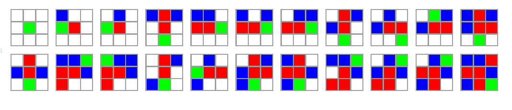
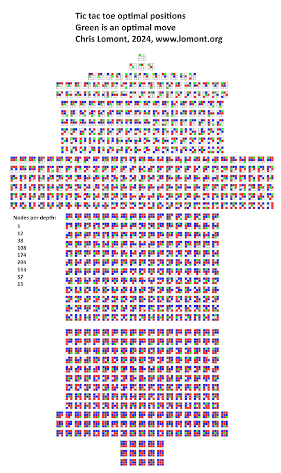
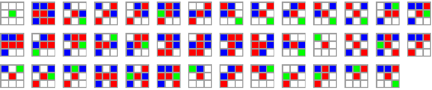
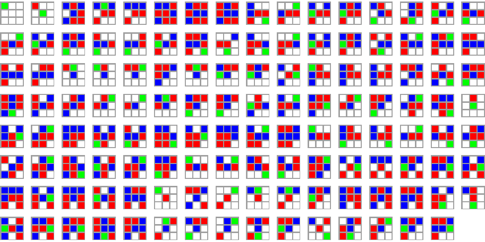
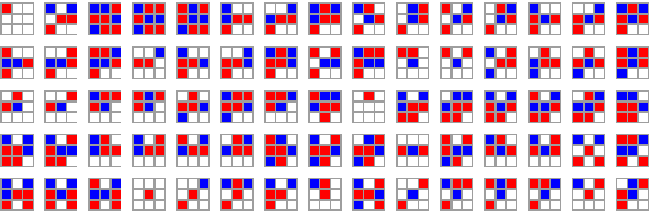
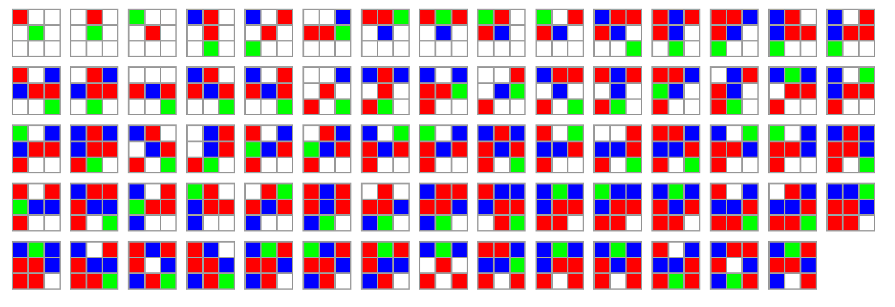
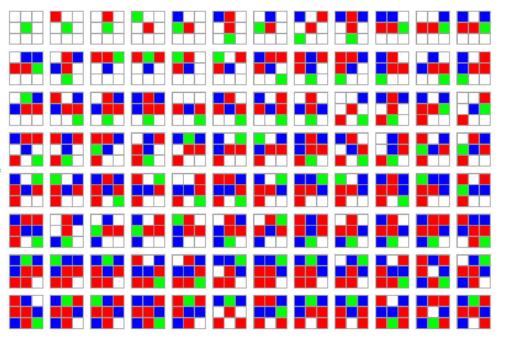

# Minimal Size Tic Tac Toe Trees

Chris Lomont

July 2024

[GitHub repo](https://github.com/ChrisLomont/Minimal-tic-tac-toe)

[Blog article](https://lomont.org/posts/posts/2024/minimaltictactoe/) 


It's pretty easy (and a good programming exercise) to make a tree of all tic-tac-toe games with best moves in each position. Recently I wanted a minimal table to play perfect tic tac toe; by minimal I wanted as few table entries as possible to ensure the program is unbeatable. I found results I've not found published anywhere else, so here they are. 

These 22 table entries let a computer program play perfect tic tac toe solely by table lookups. Perfect means never losing, and winning as much as expected against random opponents. This list is provably (in the mathematical sense) minimal. This note describes how I made this.



Code implementing all of this in C# (and some Mathematica for images) is on my GitHub site at https://github.com/ChrisLomont/Minimal-tic-tac-toe.

## Start

Represent a tic-tac-toe board as array of 9 integers, indexed by 0-8, ordered top row first, left to right, then middle row, then bottom row.

```
+-+-+-+
|0|1|2|
+-+-+-+
|3|4|5|
+-+-+-+
|6|7|8|
+-+-+-+

given row, column in 0-2, can compute

int Index(r,c)=> c + r*3
(int r, int c) Deindex(index) => (index/3,index%3)

```

Each entry holds a the integer 0 for empty, 1 for player 1, and 2 for player 2. Since there is no preferred tic-tac-toe convention if 'X' or 'O' goes first, and since the phrase "X's and O's" is more common than "O's and X's", I choose the convention that player 1 plays 'X' and player 2 plays 'O'.

## Game trees

There are 9! = 362,880 orderings of the nine cells, but many positions are not reachable since the game often ends earlier. So to get the actual number of possible games requires a little computation. One simple method is the usual recursive tree searcher:

```
Recurse(board)
   count position
   if game over, return
   for each move possible from board
      do move to board
      Recurse(board)
      undo the move on board
```

This simple idea, recurse on positions, gen moves, loop over them, do move, recurse, undo move, is a really  nice and easy tree searcher for problems like this.

Call this the full tree searcher. It hits 549,946 nodes and has 255,168 leaf nodes, i.e., those ending in a win for player 1 (131,184 (51.41%)), those ending in a win for player 2 (77,904 (30.53%)), and those ending in a forced draw (46,080 (18.06%)) (note a draw is necessarily a full board).

However, many positions are identical, and we can save lots of work by computing positions that have been seen. A simple and useful method is to store the board as an integer representing the board by treating the board as a base 3 number:

```
hash = 0
for i = 8; i >= 0; i = i - 1
   hash = 3 * hash + board[i]
```

Note hash must be in the range 0 (empty board) to 3^9-1 = 19,682. However the latter does not occur: it requires a board filled with all 2's. The largest actual node has value 19560.

Update the recursion to skip seen boards by adding three lines to the recursion:

```
hashset<int> seen

Recurse(board)

   h = hash(board)
   if seen(h), return 
   seen.add(h)
   
   count node
   if game over, return
   for each move possible from board
      do move to board
      Recurse(board)
      undo the move on board
```

This searches 16,168 nodes, retains 5,478 unique positions, a huge reduction in the size of nodes needed. Again the largest occurring hash is 19560.

Now many of these boards are symmetric variants of others in the tree. For example the games given by moves 123 and the moves 147 are symmetric by rotating the board 90 degrees, or alternatively in this case, flipping on the diagonal.

So how do we represent a board by a 'canonical' symmetric value? Simply try all 8 **symmetries** (4 rotations, flip left/right, and 4 more rotations) and keep the minimum hash value version.

It will be useful to save the **permutation** of a board to get to the canonical one, so denote a permutation 0-7 as a three bit number $b_2b_1b_0$, and then

```
permute(row,col)
   if b0 set then row = 2 - row
   if b1 set then col = 2 - col
   if b2 set then (row,col) = (col,row)
```

To invert the permutation simply do the steps in reverse. Then make a function **minHash** that takes a board and returns the smallest hash of the 8 symmetries, the permutation that gets there, and the new_board that is the minimal representative.

Now we can replace the recurse of the game state with (note we operate on the minimal representative, which can be useful later...)

```
hashset<int> seen_symmetry

Recurse(board)

   minH,perm,new_board = minHash(board)
   if seen(minH), return 
   seen.add(minH)
   
   count node
   if game over, return
   for each move possible from new_board
      do move to new_board
      Recurse(new_board)
      undo the move on new_board
```

This searches 2,271 nodes, retains **765 unique positions**, another reduction in the size of nodes needed. Reducing by symmetry caused the largest occurring hash to be lower than before, at value 17141.

To summarize so far:

| Tree reduction/search method       | Nodes examined | Max hash value | Nodes in final tree |
| ---------------------------------- | -------------- | -------------- | ------------------- |
| Full tree                          | 549946         | 19560          | 549946              |
| Positions hashed                   | 16168          | 19560          | 5478                |
| Positions hashed, symmetry removed | 2271           | 17141          | **765**             |

Here is a representation of these 765 nodes, split by depth.



## Best moves

To make this node search into a perfect playing tic tac toe machine, we will store a **tree** of the nodes reached by adding **children** to each node during the recursion. Simply have the **recurse** function return a node that the parent caller can attach to a child index:

```
recurse(...)
   ...
      do move to new_board
      Recurse(new_board)
      undo the move on new_board
      ...
      
becomes

node recurse(...)
   ...
      do move to new_board
      new_board.child[move] = Recurse(new_board)
      undo the move on new_board
      ...
     return new_node
```

Now we have a tree. To compute optimal moves you can use the [**minimax algorithm**](https://en.wikipedia.org/wiki/Minimax) during the recursion of the tree. However I've found for problem this small and simple, mixing the construction minimax makes the code a bit messy, harder to get right, and harder to debug. Keeping them separate also lets you fiddle with algorithm variants more easily. Here's a simple method, useful for all sorts of problems, a **frontier search**:

1. Recurse walk the tree - any leaf node (no children), score it as +1 for player 1 win, 0 for draw, and -1 for player 2 win. Mark the node as 'scored'.
2. Put all unscored nodes into a queue. Repeat this till the queue is empty:
   1. dequeue node n
   2. if all children of n are scored:
      1. score of n is the min of children scores (depth even) or the max of all children scores (depth odd)
      2. n.bestmoves = all moves that have a child with the best score.
      3. mark n scored.
   3. else if all children are not scored, enqueue n back into the queue
3. goto 2 until queue empty.

Now the tree is scored and you can play perfect games by choosing among the best moves when it is the computer turn.

Let's have the computer play a bunch of games to test the system. Make a **Play** loop that asks two different (computer) players for a move given a board. If you store the tree in a dictionary that maps a hash to a node, then given a board position, you can hash the board (or minhash for the symmetric version), get a best move (and undo the symmetry for the move in the minhash version), then return the move.

We can also make a RandomPlayer that, given a board, uniformly picks from the legal moves. We can run these three  players (**random, hashed tree, and symmetric hashed tree**), and get results like

```
FINAL: Score: Hashed tree 96844, Random Player 0, draws 3156
FINAL: Score: Random Player 0, Hashed tree 77579, draws 22421
FINAL: Score: Hashed tree 0, Hashed tree 0, draws 100000
FINAL: Score: Symmetry tree 96772, Random Player 0, draws 3228
FINAL: Score: Random Player 0, Symmetry tree 77524, draws 22476
FINAL: Score: Symmetry tree 0, Symmetry tree 0, draws 100000    
```

Note the tree based players never lose, and it looks like such things win over 95% of games against a random player as player 1 and over 75% as player 2. Note player 2 has a harder time winning than player 1.

You can make a console/other input player and play against your tree players.

## A smaller tree

Ok, so is 765 the smallest number of nodes needed? Nope, not by a long shot.

Let's start by making a tree where the computer goes first, and always picks the center, and from here on we allow the opponent to pick any legal move, but at each choice for the computer it tries to pick moves that retain any win, but that do not add to many nodes. The idea is the computer can force the game into less paths than 765 nodes will require. Online I saw someone reduce this to 45 nodes, but **I have proved that 41 nodes is the minimal number** of nodes needed, via the following techniques.

When a node $A$ is reached, and a move is chosen that goes to child $B$, we can think of this as a logic expression $A\implies B$. Think of nodes as boolean variables, with the value true if they are in the optimal tree, else false. If $A$ is hit, and then a move is made to $B$, then we denote this as the logical expression $A$ implies $B$. 

When a node $A$ is reached by the computer, it can always pick a specific child $C^A_i$ from among all the (call it $k$) children $C^A_0, C^A_1,...,C^A_k$. So we need to satisfy an expression $A$ implies one of the $C^A_j$, which is a logical OR, written $A=>\bigvee_j C^A_j$. When a node is reached by the opponent who could move to any child, this is represented using an **AND**: $B=>\bigwedge_j D^B_j$.

To find a minimal tree, we need to find the minimal number of nodes needed that satisfies all these expressions.  For the "computer moves first and plays in the center" bot, add the starting position as required (hash 0), AND the implies "start => minhash of (moved to center)" to start the thing off, then AND the clauses above for every reachable move in the 765 node tree (again, recursion makes this easy). This is a huge expression of boolean variables.

The way to solve such things is a [SAT-solver](https://en.wikipedia.org/wiki/SAT_solver), or more generally, a SMT solver ([Satisfiability Modulo Theory solver](https://en.wikipedia.org/wiki/Satisfiability_modulo_theories), which means it tries to satisfy some constraints that are specified (Modulo) in some formal system (Theory). Here we're satisfying finding some boolean expressions to make the large AND of all the items above come out true.

Setting every node to true makes it true, so we want something more - can we find the minimum number of such true nodes?

I solved this problem (and many more) with Z3 in C# and dotnet. Z3 has some optimizers that might minimize the count automatically, but it was easy enough to find a Z3 call that simply answered if there is a solution with at most $q$ nodes where I get to pick the number $q$. So I started with $q$ = # of total nodes, and did a binary search over $\{1,2,...,q\}$ to get the minimum number of nodes. Then Z3 lets me spit out the answer.

What about person first? A person can move anywhere on the first move, which should result in a larger tree (or at least it seems so.....) . Here's the results from some variants:

| Game type                       | Booleans  | Optimal |
| ------------------------------- | --------- | ------- |
| Computer first, start in corner | 352 verts | 56      |
| Computer first, start on edge   | 408 verts | 94      |
| Computer first, start in center | 201       | **41**  |
| Human first (any move)          | 282       | **127** |

You can make a bot able to play first or second by merging the 41 and 127 trees into a tree with 168 nodes. There are also ways to have the SMT solver solve the both player case directly (exercise left to reader).

Here's the 41 size set



And here's the 127



## one side makes you smaller...


Now, this seems pretty minimal. But can we go smaller? Yep, we can. Consider the 41 nodes for the computer first, move to center version. The only moves to lookup in a game are those with even depth - we can throw out odd depth nodes. This gives a 22 node tree. But what if this can be shrunk? Since we solved the expression requiring odd depth nodes, it may be some weird trick that if we model only the even depth nodes, that there is an even smaller set of even nodes....

To do this, consider "implies" clauses. When the computer reaches node $A$, then it chooses one node of it's children $B$ (an OR clause over all children), and, if that node is chosen, then all grandchildren $G^A_B$ of $A$ going through $B$ must be chosen since the opponent can choose any of them. So this leads to clauses that look like $A=>\bigvee_B (\bigwedge G^A_B)$.  Now the only nodes result in the provably minimal set of 22 nodes:


To track moves from parent to child (to make the clause relating parent to grandchildren), it is helpful to intorduce more boolean variables to track the edge chosen so we get optimal moves easier. Then it is equivalent to find the minimal set of nodes, or the minimal set of edges chosen (tracking parent and child, for example).

Applying this alternating level idea to the previous combinations gives the following table:

| Game type                       | Booleans             | Optimal                    |
| ------------------------------- | -------------------- | -------------------------- |
| Computer first, start in corner | 195 verts, 344 edges | 30 verts (or 30 edges)     |
| Computer first, start on edge   | 226 verts, 400 edges | 51 verts (or 51 edges)     |
| Computer first, start in center | 95 verts, 201 edges  | **22 verts (or 22 edges)** |
| Human first (any move)          | 158 verts, 248 edges | **75 verts (or 74 edges)** |

The Optimal column has minimal vertex count, or equivalently optimal edge count. These are the same except the last case, where there is one less edge to choose (and the final full board with no move is left). In this case we can drop that last node, using the ones from the 74 edges, and obtain a playable table.

Here is the 75 list:



Here is the 74 table



Thus, combining the 22 and 74 vertices, **we obtain the final playable table of 96 nodes**.

 

## Playing strength

A simple way to see how good the table plays, we can compare it in a round robin tournament with a perfect hashed tree player, table player, and a random player, each series over 100,000 games, to obtain the following scores:

| Player 1 wins              | Player 2 wins              | Draws            |
| -------------------------- | -------------------------- | ---------------- |
| Hash tree 96844 (96.84%),  | Random 0 (0.00%),          | 3156 (3.16%)     |
| Random 0 (0.00%),          | Hash tree 77579 (77.58%),  | 22421 (22.42%)   |
| Tiny table 95777 (95.78%), | Random 0 (0.00%),          | 4223 (4.22%)     |
| Random 0 (0.00%),          | Tiny table 85070 (85.07%), | 14930 (14.93%)   |
| Hash tree 0 (0.00%),       | Tiny table 0 (0.00%),      | 100000 (100.00%) |
| Tiny table 0 (0.00%),      | Hash tree 0 (0.00%),       | 100000 (100.00%) |

As expected, neither tree or table players ever lose. And, even though the minimal table tree was not optimized for maximal wins, it performs as well as the full hashed node tree.

So, from the naive entire tree of  549,946 nodes with 255,168 leaf nodes, we have made an equivalently powerful tic tac toe playing table using just 96 nodes (and no leaf nodes, since they get implied by the result stored with a move).

This is a reduction of nearly 6000 fold.

Again, here is the GitHub repo with all supporting code https://github.com/ChrisLomont/Minimal-tic-tac-toe

Happy hacking!


